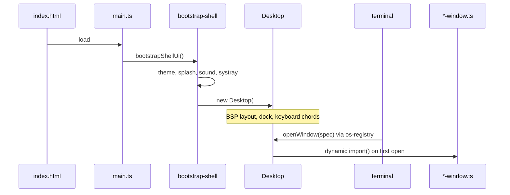

# Architecture

Technical map of the portfolio desktop OS. For a narrative introduction see [OVERVIEW.md](./OVERVIEW.md). For change recipes see [DEVELOPMENT.md](./DEVELOPMENT.md) and [AGENTS.md](./AGENTS.md).

---

## System diagram



---

## Entry points

| File | Purpose |
|------|---------|
| `index.html` | Desktop shell — monitor frame, YASB bar, launcher, `#panes` → `#right-pane` |
| `static/index.html` | Brochure — no OS chrome; mobile redirect target |
| `src/main.ts` | Imports CSS, calls `bootstrapShellUi()` |
| `src/bootstrap-shell.ts` | Boot splash → theme → wallpaper → retro FX → sound → systray → `Desktop` → matrix rain (idle) |
| `src/static/main.ts` | Brochure: hero, sections, scroll-spy, motion |

**Terminal is not in static HTML.** It opens as a lazy tile (`Ctrl+T`, dock, or `terminal` command).

---

## Bootstrap order

1. `runBootSplash()` — skippable after first visit (`mrgrey-boot-seen`)
2. `initThemeFromStorage()` — apply `--th-*` tokens + xterm palette
3. `loadSavedWallpaper()`
4. `initRetroFxFromStorage()`
5. `initOsSound()` + `initSystray()`
6. `new Desktop(desktopEl)` — WM, dock, folder tiles, keyboard listener
7. `initMatrixBg()` — deferred via `requestIdleCallback`

---

## Module layers

### Window manager (`desktop*.ts`)

`desktop.ts` (~340 lines) orchestrates extracted subsystems via `desktop-wm-hosts.ts`:

| Module | Responsibility |
|--------|----------------|
| `desktop.ts` | Public API, `openWindow`, global key listener, sync |
| `desktop-wm-hosts.ts` | Context objects wired into WM modules |
| `desktop-open-window.ts` | Lazy tile dispatch (`dispatchOpenWindow`) |
| `desktop-wm-lifecycle.ts` | Mount / close / minimize / restore + animations |
| `desktop-wm-maximize.ts` | Content-window maximize (`max-content` on `#panes`) |
| `desktop-wm-focus.ts` | Focus tile / terminal tile |
| `desktop-wm-sync.ts` | `#desktop` `dataset.*` for CSS (counts, maximized, terminal closed) |
| `desktop-wm-tile-limit.ts` | Cap visible tiles; bump oldest to dock |
| `desktop-wm-animations.ts` | Mount/unmount animation classes |
| `desktop-wm-terminal.ts` | YASB Applications button chrome |
| `desktop-keyboard-handler.ts` | Ctrl+chord routing |
| `desktop-keyboard-chords.ts` | Allowed WM key set |
| `desktop-spatial-focus.ts` | Ctrl+H/J/K/L bounding-rect focus |
| `desktop-taskbar.ts` | Dock render, YASB title, auto-hide |
| `desktop-launcher-overlay.ts` | Show-desktop + launcher overlay state |
| `desktop-launcher-grid.ts` | Applications icon grid |
| `desktop-window-spec.ts` | `WindowSpec` builders from command names |
| `desktop-ps-snapshot.ts` | Fake `ps` rows for MOTD |
| `desktop-tiles.ts` | Draggable folder icons on workspace |
| `launcher-catalog.ts` | Dock pins, launcher rows, chunk prefetch |

### Layout

| Module | Responsibility |
|--------|----------------|
| `bsp-layout.ts` | Two-column BSP; shorter column first; max 4 visible |
| `splitter.ts` | Pointer drag resize (column width / row height) |
| `window-layout.ts` | `WindowLayout` interface |

### Window tiles (`*-window.ts`)

Self-contained classes with `el`, `command`, WM callbacks. Lazy-loaded except `appwindow.ts`.

| Module | Type |
|--------|------|
| `appwindow.ts` | Portfolio content (resume, projects, contact, about) |
| `terminal.ts` | xterm.js shell + command dispatch |
| `editor-window.ts` | Modal vim editor over VFS |
| `file-explorer-window.ts` | VFS browser |
| `browser-window.ts` | iframe + URL bar |
| `paint-window.ts` | Pixel canvas |
| `p5-window.ts` | Sandboxed p5 viewer |
| `rubik-window.ts` | Three.js Rubik cube |
| `pong-window.ts` / `snake-window.ts` | Arcade games |

Three.js ships **only** in the `rubik-window` lazy chunk.

### Editor vim stack

| Module | Responsibility |
|--------|----------------|
| `editor-window.ts` | DOM, modes, key routing, VFS I/O |
| `editor-vim-ops.ts` | Pure text/cursor/motion helpers (unit tested) |
| `editor-vim-keys.ts` | Pure INSERT/NORMAL key-chord helpers |
| `editor-ex-commands.ts` | `:w` / `:q` / `:e` ex-mode parsing |
| `editor-window-meta.ts` | Path compare, title strings |
| `vim.ts` | **Separate** — terminal one-line vim widget |

### Fake OS (`os-*.ts`)

| Module | Purpose |
|--------|---------|
| `os-fs.ts` | VFS v8 — `portfolio-vfs-v8-namefailed-home` |
| `os-registry.ts` | `Desktop` ref for terminal → `openWindow` |
| `os-sound.ts` | Web Audio UI sounds |
| `os-systray.ts` | Toasts + settings panel |
| `os-apt.ts` / `os-packages.ts` | Joke package manager |

### Commands (`commands/`)

| File | Purpose |
|------|---------|
| `index.ts` | Registry merge |
| `app-commands.ts` | Tile stubs — `run: () => []`, desktop intercepts |
| `vfs-commands.ts` | `ls`, `cat`, `cd`, `mkdir`, … |
| `system-commands.ts` | `theme`, `neofetch`, `help`, … |
| `help-output.ts` | Help screens + `keybinds` legend |
| `cli-text-utils.ts` | `cal`, `wc`, bytes formatting |

### Content

| Path | Purpose |
|------|---------|
| `content/copy/*.ts` | Résumé, projects, about, contact copy |
| `portfolio.ts` | ANSI arrays for content tiles |
| `static/static-data.ts` | Brochure single source of truth |

### Shared utilities

| Module | Purpose |
|--------|---------|
| `storage.ts` | Safe localStorage wrapper |
| `window-chrome.ts` | Titlebar + traffic-light factory |
| `theme-packs.ts` / `theme-control.ts` | Runtime themes |
| `ansi.ts` | ANSI → HTML |
| `matrix-bg.ts` / `retro-fx.ts` / `wallpaper.ts` | Visual effects |
| `boot-splash.ts` / `welcome-guide.ts` / `hint-bubbles.ts` | Onboarding |

### Rubik model

| Module | Purpose |
|--------|---------|
| `rubik-model.ts` | Pure cube state — moves, scramble, algorithms |
| `rubik-stickers-layout.ts` | Three.js geometry helpers |

---

## Data flow: command → tile

```mermaid
flowchart LR
  A[User types command] --> B[terminal.ts]
  B --> C{commands registry}
  C -->|app command returns []| D[os-registry Desktop ref]
  D --> E[desktop.openWindow]
  E --> F[dispatchOpenWindow]
  F --> G[dynamic import *-window]
  G --> H[bsp-layout.mount]
```

---

## Build & chunks

Vite entry points (`vite.config.ts`):

- `index.html` → main bundle + lazy chunks per tile
- `static/index.html` → separate brochure bundle

`prefetchLazyWindowModule()` in `launcher-catalog.ts` warms chunks on launcher hover.

---

## Stylesheets

| Area | Location |
|------|----------|
| Desktop | `src/styles/section.css` + `section-2.css` … `section-22.css` via `src/style.css` |
| Brochure | `src/static/static.css` (`--plain-*` tokens) |

Regenerate split CSS: `node scripts/split-style-css.mjs`

---

## State persistence

All client-side via `storage.ts`:

| Key | Contents |
|-----|----------|
| `portfolio-vfs-v8-namefailed-home` | VFS tree + cwd |
| `mrgrey-theme` | Theme id |
| `mrgrey-os-sound` / `mrgrey-os-volume` | Audio prefs |
| `mrgrey-retro-fx` | CRT toggle |
| `mrgrey-matrix-bg` | Matrix rain |
| `mrgrey-wallpaper` | Wallpaper URL |
| `mrgrey-desktop-tile-positions-v6` | Folder tile positions |
| `portfolio-fe-prefs-v1` | File explorer prefs |
| `mrgrey-boot-seen` / `mrgrey-guide-seen` / `mrgrey-toasts-seen` | Onboarding flags |

Full list: [AGENTS.md](./AGENTS.md#localstorage-keys-authoritative).

Bump VFS key version in `os-fs.ts` to reset visitor filesystems.

---

## Testing

**583 tests** · **46 files** · Vitest in Node · Playwright e2e smoke.

### By domain

| Domain | Example test files |
|--------|-------------------|
| WM / desktop | `desktop.test.ts`, `desktop-wm-*.test.ts`, `desktop-keyboard-handler.test.ts`, `bsp-layout.test.ts` |
| Editor vim | `editor-vim-ops.test.ts`, `editor-vim-keys.test.ts`, `editor-ex-commands.test.ts` |
| Terminal / vim | `vim.test.ts`, `terminal-motd.test.ts` |
| VFS / commands | `os-fs.test.ts`, `commands/*.test.ts` |
| Tiles / launcher | `launcher-catalog.test.ts`, `desktop-open-window.test.ts`, `window-chrome.test.ts` |
| Rubik | `rubik-model.test.ts`, `rubik-stickers-layout.test.ts` |
| Theme / FX | `theme-control.test.ts`, `matrix-bg.test.ts`, `retro-fx.test.ts`, `wallpaper.test.ts` |
| Brochure | `static/static-motion.test.ts`, `static-portfolio-href.test.ts` |
| Content | `content/portfolio.test.ts`, `p5-sketches.test.ts` |

```bash
npm test
npm run test:coverage
npm run test:e2e
```

---

## Naming conventions

| Pattern | Meaning |
|---------|---------|
| `*-window.ts` | Lazy-loaded tile |
| `desktop-wm-*` | Window manager subsystem |
| `os-*` | Fake OS layer |
| `initXFromStorage` | Boot-time restore from localStorage |
| `editor-vim-*` | Pure editor helpers |

Details: [STYLE_GUIDE.md](./STYLE_GUIDE.md).

---

## Key patterns

### Window chrome

```typescript
const { el, titleEl } = createWindowChrome({
  title: 'My Tile',
  onClose, onMinimize, onMaximize, onFocus,
})
```

### Lazy open

```typescript
// desktop-open-window.ts
case 'myapp': {
  const { MyAppWindow } = await import('./myapp-window')
  // mount via layout + push to windows[]
}
```

### Theme pack

Self-contained `ThemePack` in `theme-packs.ts` — picker auto-detects new entries.

---

## CI / deploy

`.github/workflows/deploy-pages.yml`:

`lint` → `npm test` → `npm run build` → `npm run test:e2e` → upload `dist/` → GitHub Pages

---

## See also

- [OVERVIEW.md](./OVERVIEW.md) — project narrative for reviewers
- [API.md](./API.md) — type reference
- [AGENTS.md](./AGENTS.md) — agent change recipes
- [THEMING.md](./THEMING.md) — `--th-*` catalogue
