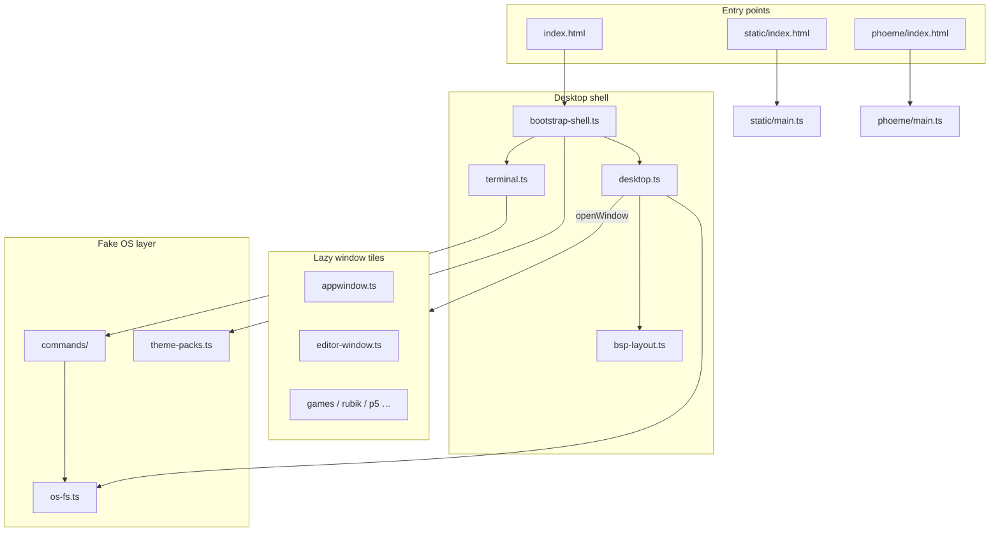

# Project Overview

**Live:** [mrgrey.site](https://mrgrey.site) · **Source:** [github.com/namefailed/namefailed.github.io](https://github.com/namefailed/namefailed.github.io)

This repository is a **personal portfolio implemented as a fake desktop operating system** in the browser. Instead of scrolling through a PDF résumé, visitors open windows, run shell commands, edit files in a vim-style editor, and explore interactive demos — while the same content is also available as a conventional brochure at `/static/`.

---

## What problem it solves

Traditional portfolio sites show information. This one **demonstrates how the author builds software**: structured TypeScript, tested modules, lazy-loaded bundles, keyboard-driven UX, and persistent client-side state — all without a UI framework.

The desktop metaphor is not decorative. It is the architecture:

- **Terminal commands** map to **window tiles** (résumé, projects, editor, games).
- A **virtual filesystem** backs real read/write operations in `localStorage`.
- A **tiling window manager** handles focus, minimize, maximize, and spatial navigation.
- **Seven colour themes** swap the entire UI and terminal palette at runtime.

---

## High-level architecture

---

## Technical highlights

### No framework — deliberate choice

The UI is built with **vanilla TypeScript and DOM APIs**. State lives in class instances and `localStorage`, not in a global store. This keeps bundle size predictable and makes every interaction traceable in source.

### Code splitting by feature

Each window tile (`editor-window.ts`, `rubik-window.ts`, etc.) is loaded with **dynamic `import()`** on first open. cubing.js — and the Three.js renderer it bundles internally — never touches the main bundle; it ships only inside the Rubik cube chunk.

### Window manager extracted into modules

`desktop.ts` (~340 lines) orchestrates subsystems that were split for testability:

| Module | Responsibility |
|--------|----------------|
| `desktop-open-window.ts` | Dispatch which tile to open |
| `desktop-wm-lifecycle.ts` | Mount / close / minimize animations |
| `desktop-wm-maximize.ts` | Full-pane maximize |
| `desktop-spatial-focus.ts` | Ctrl+H/J/K/L geometry |
| `desktop-taskbar.ts` | Dock and YASB status bar |
| `bsp-layout.ts` | Two-column tiling with drag splitters |

### Two vim implementations

| Layer | Module | Purpose |
|-------|--------|---------|
| Terminal one-liner | `vim.ts` | Shell prompt — insert/normal/visual, history, completion |
| Modal editor tile | `editor-window.ts` + vim stack | Full buffer editor over the VFS — motions, operators, ex commands |

Pure caret and edit helpers (`editor-vim-motions.ts`, `editor-vim-edits.ts`) are **unit-tested without a DOM**, which keeps editor logic maintainable.

### Virtual filesystem (VFS v8)

Files persist in `localStorage` under `portfolio-vfs-v8-namefailed-home`. First visit seeds `~/sketches/` with p5.js examples and `~/p5.js/` with reference material. Shell commands (`ls`, `cat`, `edit`, `mkdir`, …) operate on this tree.

### Test coverage and CI

| Stage | Tool |
|-------|------|
| Unit | Vitest — **615 tests**, **60 files**, Node environment with DOM stubs where needed |
| Lint | ESLint 9 + TypeScript-eslint |
| E2e | Playwright — production build smoke (desktop shell, brochure, Phoneme product page) |
| Deploy | GitHub Actions → `dist/` → GitHub Pages |

Every push to `main` runs the full pipeline before deploy.

### Accessibility and motion

- `prefers-reduced-motion` respected in brochure animations and WM transitions
- Keyboard-first navigation documented in `keybinds` shell command
- Skip links and ARIA labels on window chrome

---

## Entry points: desktop, brochure, product page

| Route | Audience | Behaviour |
|-------|----------|-----------|
| `/` | Desktop experience | Full OS chrome, terminal, tiling |
| `/static/` | Mobile + print-friendly | Scroll-based résumé; viewport ≤768px auto-redirects here |
| `/phoeme/` | Phoneme app visitors | Standalone product page for the [Phoneme](https://github.com/namefailed/phoneme) transcription app; `/phoneme/` redirects here |

The desktop and brochure share portfolio **content** (`src/content/`, `src/static/static-data.ts`) but use separate CSS token systems (`--th-*` vs `--plain-*`). The Phoneme page is fully independent (`src/phoeme/`) and reuses only the shared brochure theme switcher.

---

## Skills this project demonstrates

- **TypeScript** — strict typing, module boundaries, no `any`
- **Browser APIs** — Canvas, Web Audio, `localStorage`, dynamic imports, `ResizeObserver`
- **UX engineering** — keyboard chords, spatial focus, lazy prefetch on launcher hover
- **Graphics** — xterm.js integration, cubing.js Rubik cube, p5.js sandboxed viewer
- **Testing** — co-located unit tests, fake DOM stubs, CI-gated e2e
- **Documentation** — architecture docs, API reference, agent-oriented guides

---

## Where to go next

| Goal | Document |
|------|----------|
| Try the site | [USER_GUIDE.md](./USER_GUIDE.md) |
| Understand modules in depth | [ARCHITECTURE.md](./ARCHITECTURE.md) |
| Set up locally | [DEVELOPMENT.md](./DEVELOPMENT.md) |
| Extend commands or tiles | [API.md](./API.md) + [AGENTS.md](./AGENTS.md) |
